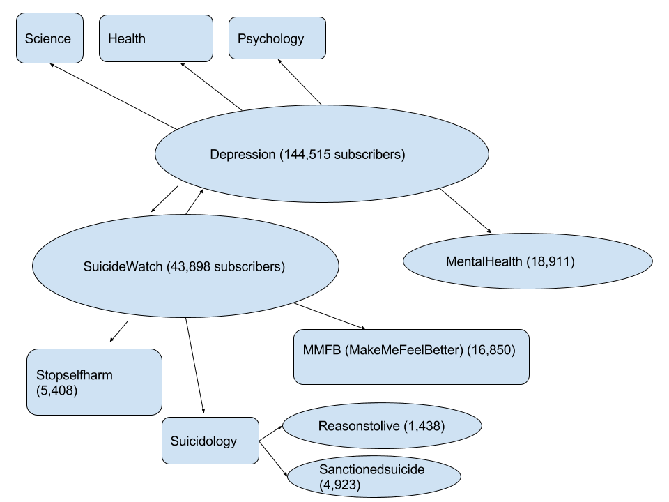
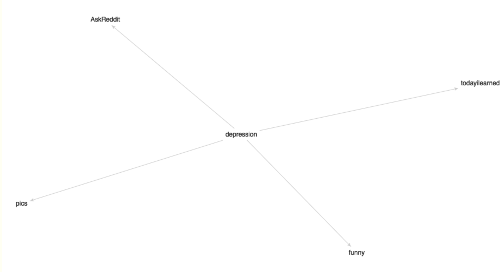

```{r setup, include=FALSE}
knitr::opts_chunk$set(echo = FALSE)
```

## Which project you are working on?

I am working on a project on mental health (specifically suicidal ideation) and trolling among Reddit users, along with Lacey. Generally, we are interested in whether we can identify users that are depressed, and their identifying characteristics, as well as the relationship between trolling and mental health among Reddit users.


Reddit is a popular online message board, commonly used to share news and images, as well as discussion on user-created topics. It is the 11th most popular website in the US, ranked just under Twitter which comes in at #10. Notably, some discussion boards (known as “subreddits”) are used to provide and ask for advice and support, and many users share deeply personal information and emotional states. We are particularly interested in how we might be able to identify suicidal ideation among Reddit users, as many users post suicide notes and/or reveal intention to commit suicide.

**Some possible questions we might pursue are:**


1. Suppose we treat suicidal ideation as a missing data problem, in which some users admit intention to commit suicide in their posts, and others are suicidal but do not post suicide notes or otherwise publicly admit suicidal intentions. Can we predict which users are suicidal based on their posts or activity?

2. What are the posting patterns of users that reveal suicidal ideation in their posts? Do they usually make one post and leave the site, or were they previously active? How many users, after posting about suicidal ideation, “disappear” from a formerly active account, or conversely, continue to post?

Secondly, like many other popular message boards like 4chan, Reddit has an active troll culture. Although some trolling is relatively benign, online harassment is almost omnipresent wherever internet surfers are permitted to write comments. Finding efficient ways to identify trolls then, would be beneficial for anyone who runs a site that allows for user input, on social media, content-based websites, as well as discussion boards like Reddit.

To control trolling on its discussion boards, Reddit is moderated almost entirely by volunteers, and the reporting of trolls is crowdsourced. Comments that other users that are down voted sufficiently many times are hidden, and users are give the option to report inappropriate comments to moderators. Last year, the newly minted (and first female) Reddit CEO Ellen Pao attempted to control trolling on Reddit by banning some of the most popular troll subreddits. However, due to user backlash, she resigned a short time later.

**Some possible research questions are:**

1. Can we identify potential/current Reddit trolls using a combination of their post history, username, subreddits they are active in, etc.? 

2. Was Ellen Pao’s attempt to reduce trolling successful? I.e., did the incidence of trolling across Reddit/in the most popular subreddits change after notorious troll subreddits were banned from the site?

3. Can we identify threads or contexts most likely to produce trolls?

However, I’m still not sure how feasible answering any of these questions might be, as we have not cleaned up the data.

## What you have started to do on the project?
Reddit's API severely restricts access to their data to people who haven't registered as developers on the site, so to scrape their data I created a Reddit account and downloaded PRAW, a Python package that allows for easy access to Reddit's API.

**Sourcing data**

First, I tried to get a small sample dataset to see how the data is formatted. Using a Python package found on github, subredditarchive.py (from here: https://github.com/peoplma/subredditarchive), I scraped 1 week's worth of posts from a single subreddit (r/sanctionedsuicide), a smaller subreddit which seems to have a relatively high density of suicide notes. The package gets all posts in a subreddit between two user-indicated time periods, and returns them as a set of JSON files, where each thread gets its own JSON file, containing the original post as well as the child posts.

I also started writing up a JSON parser in R that collects the relevant information from a single JSON file and puts them in a data frame. (The code right now is quite ugly, but I plan to clean it up over the weekend.)

Furthermore, there are several other Reddit datasets available that have already been scraped. Notably, 1.7 billion Reddit comments are said to be collected in a 250 GB file, as well as one month of comments in a 32 GB file. These datasets have also been uploaded to online repositories like Google’s BigQuery. I am not sure if these will come in handy since they are quite large, but they may be worth examining after analyzing smaller datasets.

**Developing a question**

To identify which subreddits might be of interest to analyze, I was curious about which subreddits tended to share the same users. I first looked for related subreddits in r/depression, Reddit’s largest depression subreddit, and followed the sidebar links to identify subreddits that its users may also frequent. Sidebar links are depicted in the image below:

image:  

The number of subscribers in relevant subreddits is given in parentheses.

Then, using the BigQuery dataset of all comments posted in May 2015 and code provided by Reddit user u/fhoffa, I found the subreddits that share the most users (more than 10%) with r/depression:

image:  

sub_a | sub_b |percent | sub_ac | sub_bc
------|------- | ------|------- | ------|
depression | AskReddit |38 | 4 | 1
depression | funny |14 | 4 | 1
depression | pics |13 | 4 | 1
depression | todayilearned |12 | 4 | 1

Understandably, r/depression shares 38% of its users with r/AskReddit, a discussion board in which users ask for and receive advice on their life problems. However, one unexpected feature of this search is that r/depression shares 14% of its users with r/funny. One possible option for the project would be to try to identify users in r/funny that may be depressed. (The other depression subreddits were too small to find related subreddits using this method, as none of them shared over 10% of their userbase with a different subreddit.)


## What do you plan to do over the next week?

Next week, I plan to:

* finish a parser that will read in multiple JSON files and put the relevant information in a data frame
* start classifying the text data by coming up with a list of regular expressions and using them to identify posts related to:
    + suicidal ideation comments (e.g., grep phrases like “want to die”, “want to end it”, etc.)
    + troll comments (e.g., grep memetic phrases that encourage other users to commit suicide, e.g. “kill yourself”, “do it f*****”, etc, as well as slurs)
* finalize my question, depending on what data is available
* determine which subreddits to scrape

Although I am interested in the relationship between trolling and mental health, I’m concerned about being able to identify instances of trolling because of Reddit’s moderators (particularly in depression subreddits, as the moderation there is so strict). The feasibility of such research questions will hopefully be resolved after exploring the data more.