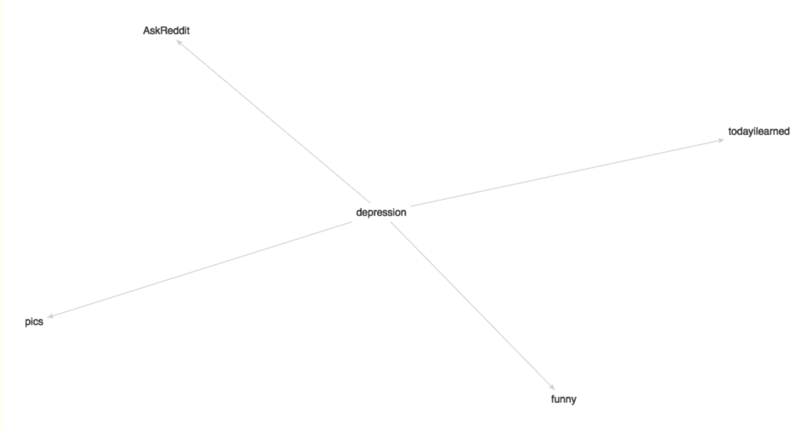

```{r setup, include=FALSE}
knitr::opts_chunk$set(echo = TRUE)
```

## A specific, quantitative statement of the question you are asking 

Our current goal is to create a classification algorithm that will classify Reddit comment text as indicating suicidal ideation or not. After creating this algorithm, if we have time, we can apply it to other contexts (e.g. users, subreddits) to answer more questions about suicidal ideation on Reddit generally.

**Some possible questions we might pursue are:**


1. Suppose we treat suicidal ideation as a missing data problem, in which some users admit intention to commit suicide in their posts, and others are suicidal but do not post suicide notes or otherwise publicly admit suicidal intentions. Can we predict which users are suicidal based on their posts or activity?

2. What are the posting patterns of users that reveal suicidal ideation in their posts? Do they usually make one post and leave the site, or were they previously active? How many users, after posting about suicidal ideation, “disappear” from a formerly active account, or conversely, continue to post?

Another possibility is to examine the relationship between trolling and suicidal ideation. 

**Some possible research questions are:**

1. Can we identify potential/current Reddit trolls using a combination of their post history, username, subreddits they are active in, etc.? 

2. Was Ellen Pao’s attempt to reduce trolling successful? I.e., did the incidence of trolling across Reddit/in the most popular subreddits change after notorious troll subreddits were banned from the site?

3. Can we identify threads or contexts most likely to produce trolls?


## A description of the data you...

### plan to collect
We plan to randomly sample about 400 comments from both depression-related and non-depression related subreddits, about 75% of which will come from depression-related subreddits (as not all depressed posts contain mentions of suicidal ideation). Then, we plan to skim each post to hand-code it as either suicidal or non-suicidal. Finally, we can divide the posts into training and test sets to develop and test our classification algorithm.

###  have in hand
Not sure whether this is useful anymore now that we've changed our focus/sampling method, but I have:

##### a small sample dataset,
which we can use to see how the data is formatted. Using a Python package found on github, subredditarchive.py (from here: https://github.com/peoplma/subredditarchive), I scraped 1 week's worth of posts from a single subreddit (r/sanctionedsuicide), a smaller subreddit which seems to have a relatively high density of suicide notes. The package gets all posts in a subreddit between two user-indicated time periods, and returns them as a set of JSON files, where each thread gets its own JSON file, containing the original post as well as the child posts.

##### the BigQuery dataset,
which contains all comments posted in May 2015 and code provided by Reddit user u/fhoffa. Using this, I found the subreddits that share the most users (more than 10%) with r/depression:

image:  

sub_a | sub_b |percent | sub_ac | sub_bc
------|------- | ------|------- | ------|
depression | AskReddit |38 | 4 | 1
depression | funny |14 | 4 | 1
depression | pics |13 | 4 | 1
depression | todayilearned |12 | 4 | 1

Understandably, r/depression shares 38% of its users with r/AskReddit, a discussion board in which users ask for and receive advice on their life problems. However, one unexpected feature of this search is that r/depression shares 14% of its users with r/funny. One possible future direction for the project would be to try to identify users in r/funny that may be depressed. (The other depression subreddits were too small to find related subreddits using this method, as none of them shared over 10% of their userbase with a different subreddit.)

## Any analysis/data collection you have done
No analysis yet. For data collection, see previous section.